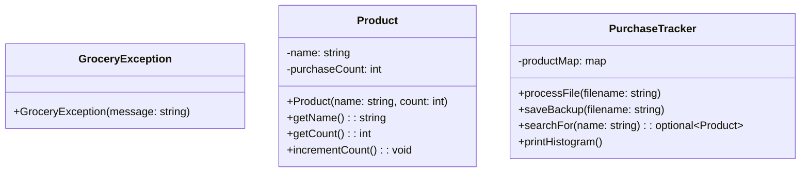

# purchase-tracker
High-performance C++ purchase tracker leveraging the STL std::map for efficient lookups. Features automated file processing, custom exception handling, and a type-safe data architecture to ensure data integrity and system scalability.

## Project Walkthrough
[Watch the Code & Design Decisions Video](https://www.youtube.com/watch?v=BAAXRKKScPQ)

*A robust backend solution designed in C++ using Object-Oriented principles.*

 ## How to Run

1. Clone this repository: `git clone https://github.com/your-username/purchase-tracker.git`

2. Compile using G++: `g++ -o stock_sync main.cpp grocery_tracker.cpp product.cpp`

3. Run the executable: `./stock_sync`
