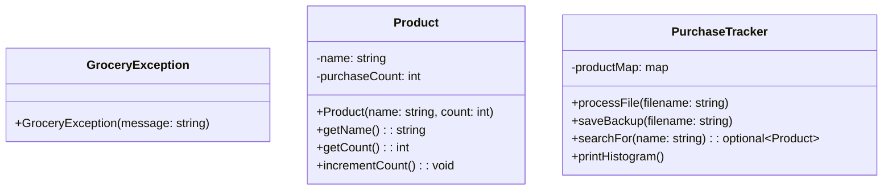

# purchase-tracker
High-performance C++ purchase tracker leveraging the STL std::map for efficient lookups. Features automated file processing, custom exception handling, and a type-safe data architecture to ensure data integrity and system scalability.

    std_runtime_error <|-- GroceryException : inheritance
    PurchaseTracker o-- Product : composition
